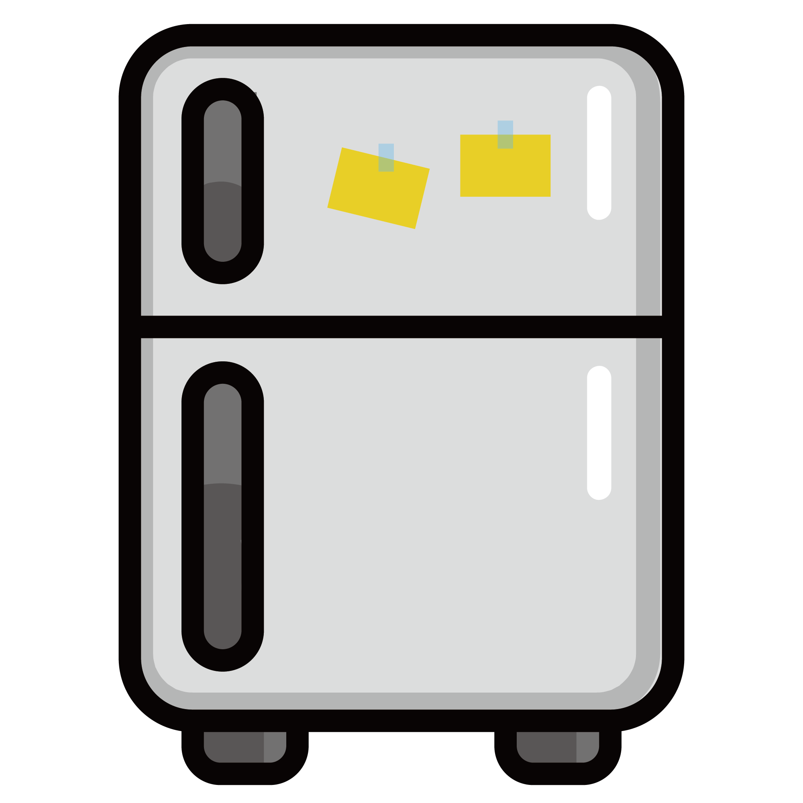

# The Fridge

## [Go to the Fridge!](https://dazzling-nougat-f934c6.netlify.app/)

Welcome to The Fridge, your culinary companion for creative recipes based on your fridge's ingredients!

## Project Overview

The Fridge is a web application that helps you discover recipes based on the ingredients you have in your fridge. It offers a user-friendly interface to search for recipes, apply filters, and find inspiration for your next delicious meal.

## Live Deployment

Visit the live deployment of The Fridge: [https://dazzling-nougat-f934c6.netlify.app/](https://dazzling-nougat-f934c6.netlify.app/)

## Screenshots

For a visual overview of the project, check out the presentation slides: [Project Presentation](https://docs.google.com/presentation/d/1KLldcDxYDTauy8v4MqIc9yjOW7Hb7UWFtuKx3YxF0m4/edit#slide=id.g2addcc6b458_0_0)

## Features

- Search recipes based on ingredients
- Apply filters for dish type and dietary preferences
- View detailed information about each recipe
- Add your own recipes to share with the community

## Getting Started

To run this project locally, follow these steps:

1. Clone the repository: [https://github.com/KubraTY/The-Fridge.git](https://github.com/KubraTY/The-Fridge.git)
2. Install dependencies: `npm install`
3. Run the development server: `npm run dev`

## Technologies Used

- React
- Axios for API requests
- Netlify for deployment

---

Happy cooking! 🍲✨
